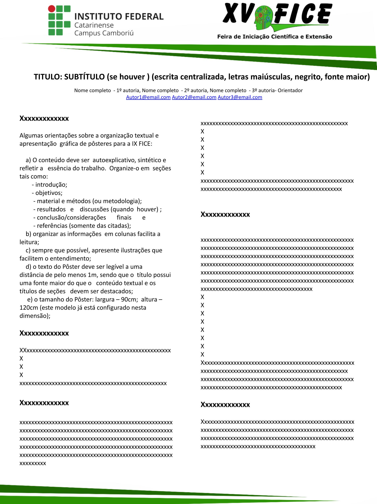

# IA23 Terceiro Trimestre

## Atividade 001

No dia 28 de setembro de 2024 a FICE - Feira de Iniciação Científica e Extensão completa 15 anos, como consolidação dos conhecimentos apresentados até o momento na disciplina de Web Design desenvolva uma pagina web que replique um dos banners de sua preferencia da feira, adicione neste banner o link para o vídeo do projeto ao qual o banner refere-se.

Esta atividade deve ser feita de maneira individual e não pode ter banners repetidos, portanto escolha com calma.

### Lista de escolhas por aluno e avaliação

[link para trabalhos aprovados na FICE2024](https://www.camboriu.ifc.edu.br/editais/wp-content/uploads/sites/15/2024/09/Edital_XV_FICE_2024_-)

| Matrícula  | Avaliação                       | Banner Escolhido                                                                                                                          |
| ---------- |:-------------------------------:| ----------------------------------------------------------------------------------------------------------------------------------------- |
| 2023307970 | [link][2023307970-tri1-trab1]ᵈ⁷ | Maquete Do Sistema Solar Em Escala                                                                                                        |
| 2024302323 |  90%                            | Artificial Meowligence: Um Jogo De Conscientização Sobre Ias                                                                              |
| 2024302360 | [link][2024302360-tri1-trab1]ᵈ⁷ | Codegamix - Jogo Web Para Ensinar Lógica De Programação                                                                                   |
| 2024304426 |  90%                            | A Inserção Da Culinária Vegana Em Estabelecimentos De Balneário Camboriú                                                                  |
| 2024304515 | 100%                            | Acampamento Farroupilha De Camboriú: Motivações Para A Participação No Evento                                                             |
| 2024304650 | 100%                            | Cloreto Na Água Subterrânea Do Ifc-Campus Camboriú                                                                                        |
| 2024304776 | [link][2024304776-tri1-trab1]ᵈ⁷ | Workolor                                                                                                                                  |
| 2024304829 | [link][2024304829-tri1-trab1]ᵈ⁷ | Lego Science Car: Explorando A Robótica E Programação Com Lego De Forma Divertida Eeducativa                                              |
| 2024304865 |  85%                            | A Utilização Da Modelagem E Impressão 3d No Ensino De Tecnologias Sustentáveis: Uma Réplica De Turbina Eólica Para O Ensino               |
| 2024304909 | [link][2024304909-tri1-trab1]ᵈ⁷ | Utilizando Kits Lego Education Spike Lego Prime No Ensino Fundamental Ii, Na Disciplina De Geografia Das Escolas Do Município De Camboriú |
| 2024306340 | [link][2024306340-tri1-trab1]ᵈ⁷ | Maquete Do Sistema Solar Em Escala                                                                                                        |
| 2024306402 | [link][2024306402-tri1-trab1]ᵈ⁷ | E.YCall - Projeto Para A Automatização De Chamadas Escolares                                                                              |
| 2024306510 | [link][2024306510-tri1-trab1]ᵈ⁷ | Leitura E Escrita: Experiência Extensionista De Oficinas Literárias Na Escola                                                             |
| 2024306636 |  90%                            | Balneário Camboriú: Turismo E Sustentabilidade                                                                                            |
| 2024306752 | [link][2024306752-tri1-trab1]*  | Maquete Do Ceit Leonel De Moura Brizola: Uma Experiência Interdisciplinar Em Cartografia, Matemática E Tecnologia                         |
| 2024306799 |  95%                            | Wvom Robô Para Medir A Velocidade E Direção Do Vento                                                                                      |
| 2024306879 | [link][2024306879-tri1-trab1]ᵈ⁷ | Análise De Substratos Para A Produção De Mudas De Ipe Amarelo                                                                             |
| 2024306921 | 100%                            | Sistema De Monitoramento De Infrações E Reabilitação Educacional Front-End                                                                |
| 2024307007 |  90%                            | Banco de Talentos do IFC Camboriú                                                                                                         |
| 2024307099 |  80%                            | Secure Bip Segurança Para Atletas                                                                                                         |
| 2024307150 | 100%                            | Percepção Dos Visitantes Quanto Ao Atrativo Turístico Parque Unipraias,Em Balneário Camboriú, Sc                                          |
| 2024307203 | [link][2024307203-tri1-trab1]ᵈ⁷ | Construção De Luvas De Corrida De Cadeira De Rodas Feitas Por Impressão 3d                                                                |
| 2024308695 |  90%                            | Análise De Alcalinidade Das Águas Subterrâneas Do Instituto Federal Catarinense                                                           |
| 2024308766 | 100%                            | Acessibilidade Para Pessoas Com Deficiência Visual Em Restaurantes De Balneário Camboriú                                                  |
| 2024309772 | [link][2024309772-tri1-trab1]ᵈ⁷ | O Perfil De Consumo Dos Participantes De Um Megaevento: Um Estudo Do Festival Lollapalooza Brasil                                         |
| 2024310307 | 100%                            | Música Experimental Ao Alcance De Todos: Desenvolvendo Um Controlador Midi Acessível                                                      |
| 2024312025 | 100%                            | Eu Sou O Robô: Aprendendo A Programar                                                                                                     |
| 2024313686 | 100%                            | Segurança dos Alimentos em Estabelecimentos da Orla da Praia                                                                              |
| 2024315519 | 100%                            | A Influência Da Cultura Popular No Turismo Em Locais De Baixa Renda: Um Estudo De Caso Em Uma Comunidade Do Rio De Janeiro                |
| 2024315564 | [link][2024315564-tri1-trab1]ᵈ⁷ | Pizzarias inclusivas para intolerância lactose de balneário Camboriú                                                                      |
| 2024316249 | [link][2024316249-tri1-trab1]*  | Speak Out Safe: Uma Plataforma Web Para O Combate Ao Assédio                                                                              |
| 2024318305 | [link][2024318305-tri1-trab1]*  | Estudo Da Percepção Dos Turistas Quanto Às Condições Da Praia Central De Balneário Camboriú, Sc.                                          |
| 2024324984 | 100%                            | Leia Mais Mulheres: Relato De Experiência Do Projeto Clube De Leitura Fridas E Lidas                                                      |
| 2024325266 |  80%                            | Iniciação Em Tecnologia: Formação Básica Em Informática Para Comunidade Externa E Acadêmicos                                              |

- ᵈ¹ ᵈ² ᵈ³ ᵈ⁴ ᵈ⁵ ᵈ⁶ ᵈ⁷ ᵈ⁸ ᵈ⁹ ᵈ¹⁰ ᵈⁿ: Entrega com dias de Atraso
- link: Trabalho ainda não avaliado
- \*: Entrega não foi possível avaliar, documento corrompido ou em branco ou outra situação que impossibilitou a avaliação.

[2024304909-tri1-trab1]: https://github.com/MrMeta-24/2024-tri2-ia24a-2024304909
[2024306752-tri1-trab1]: https://github.com/NandaSantana/2024-tri3-trab01-2024306752
[2024315564-tri1-trab1]: https://github.com/vitorelian/2024-tri2b-ia24b-2024315564.git
[2024304776-tri1-trab1]: https://github.com/TheusGraves/2024-Tri3trab01-2024304776
[2024306402-tri1-trab1]: https://github.com/Nana-wlw/2024-tri3-trab01-2024306402
[2024306340-tri1-trab1]: https://github.com/oSaiasKK/baner-2024306340
[20242304829-tri1-trab1]: https://github.com/maripfaria/2024-tri3-trab01-20242304829
[2024316249-tri1-trab1]: https://github.com/verxkkj/-2024-tri3-trab01-2024316249
[2024302360-tri1-trab1]: https://github.com/Thomas-Eric/2024-tri3-trab01--2024302360-
[2024309772-tri1-trab1]: https://github.com/finatir/2024-tri3-trab01-2024309772 

### Template dos banners FICE

### Imagens útteis

## Atividade 002

Faça uma versão do banner responsiva, onde quando não houver mais espaço na tela as colunas se tornem uma só, e caso haja muito espaço o texto deve ficar em até três colunas.

| Matrícula  | Avaliação          | Link               |
| ---------- | :----------------: | ------------------ |
| 2023307970 |                    | |
| 2024302323 |                    | |
| 2024302360 |                    | |
| 2024304426 |                    | |
| 2024304515 |                    | |
| 2024304650 |                    | |
| 2024304776 |                    | |
| 2024304829 |                    | |
| 2024304865 |                    | |
| 2024304909 |                    | |
| 2024306340 |                    | |
| 2024306402 |                    | |
| 2024306510 |                    | |
| 2024306636 |                    | |
| 2024306752 |                    | |
| 2024306799 |                    | |
| 2024306879 |                    | |
| 2024306921 |                    | |
| 2024307007 |                    | |
| 2024307099 |                    | |
| 2024307150 |                    | |
| 2024307203 |                    | |
| 2024308695 |                    | |
| 2024308766 |                    | |
| 2024309772 |                    | |
| 2024310307 |                    | |
| 2024312025 |                    | |
| 2024313686 |                    | |
| 2024315519 |                    | |
| 2024315564 |                    | |
| 2024316249 |                    | |
| 2024318305 |                    | |
| 2024324984 |                    | |
| 2024325266 |                    | |

## Atividade 003

Considerando o exemplo na pasta `tri3-trab-002` desenvolva um site responsivo que contenha um menu de navegação, que ao clicar em um item a página role até a seção correspondente, as sessões devem conter galerias de fotos sobre temas diversos (cada galeria deve ter um tema específico).

| Matrícula  | Avaliação          | Link               |
| ---------- | :----------------: | ------------------ |
| 2023307970 |                    | |
| 2024302323 |                    | |
| 2024302360 |                    | |
| 2024304426 |                    | |
| 2024304515 |                    | |
| 2024304650 |                    | |
| 2024304776 |                    | |
| 2024304829 |                    | |
| 2024304865 |                    | |
| 2024304909 |                    | |
| 2024306340 |                    | |
| 2024306402 |                    | |
| 2024306510 |                    | |
| 2024306636 |                    | |
| 2024306752 |                    | |
| 2024306799 |                    | |
| 2024306879 |                    | |
| 2024306921 |                    | |
| 2024307007 |                    | |
| 2024307099 |                    | |
| 2024307150 |                    | |
| 2024307203 |                    | |
| 2024308695 |                    | |
| 2024308766 |                    | |
| 2024309772 |                    | |
| 2024310307 |                    | |
| 2024312025 |                    | |
| 2024313686 |                    | |
| 2024315519 |                    | |
| 2024315564 |                    | |
| 2024316249 |                    | |
| 2024318305 |                    | |
| 2024324984 |                    | |
| 2024325266 |                    | |

## Atividade 004

Com base no trabalho anterior, customize as galerias para que o primeiro item ocupe um espaço maior que os demais.

## Atividade 005 - Modal

...